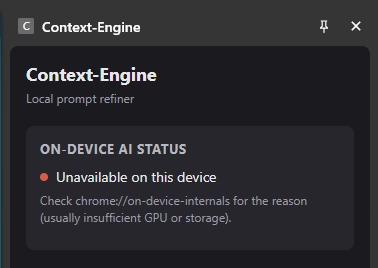
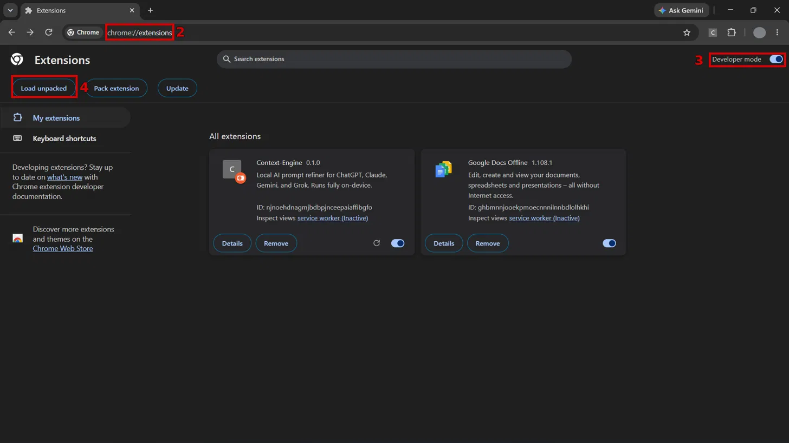

# Context Engine

> An AI-powered browser extension that transforms simple prompts into structured, context-aware prompts before they are sent to any LLM.

Context Engine acts as an intelligent prompt refinement layer between the user and AI models. Instead of replacing the model, it improves the quality of prompts using a modular knowledge base, runtime rules, and reusable prompt structures.

The goal is to make better prompting automatic—without requiring users to become prompt engineering experts.

---

## Current implementation status

The extension currently supports Claude, ChatGPT, Gemini, and Grok. It asks guided clarification questions locally through Gemini Nano, then previews a refined prompt before insertion. The finished prompt is wire-formatted for the active site: XML tags for Claude, Markdown headings for ChatGPT and Gemini, and plain labels for Grok.

For an existing supported chat, the extension first displays that it is checking the conversation. A short continuous chat is summarized locally into one sentence and supplied to the refiner as context; a fresh chat follows the normal refinement flow; a complex history asks the user to state the next task rather than guessing.

Apply Prompt inserts the complete multiline preview into the target composer and dispatches input events. It never submits the message; the user always reviews and sends it manually. There is no cloud service, persistent storage, or reference-tab scraper in this MVP.

---

# Features

- Prompt refinement before submission
- Context-aware prompt enhancement
- Modular knowledge system
- Runtime rule engine
- Structured prompt templates
- Lightweight browser extension architecture
- Model-agnostic design (works with any LLM)
- One-click "Apply Prompt" directly into the target site's chat box (user still sends manually)

---

# Why Context Engine?

Most users ask AI models vague or incomplete questions.

For example:

**Before**

```
Explain neural networks.
```

**After Context Engine**

```
Explain neural networks to a beginner.

Structure the response with:
- intuitive explanation
- real-world analogy
- simple mathematical intuition
- practical applications
- common misconceptions

Avoid unnecessary jargon unless defined.
```

The AI model remains exactly the same.

Only the prompt becomes significantly better.

---

# Project Goals

The project is designed around five principles:

- Improve prompts without changing user intent.
- Remain model-agnostic.
- Keep prompting knowledge modular and maintainable.
- Make refinement deterministic where possible.
- Separate project knowledge from runtime behavior.

---

# Architecture

```
User Prompt
      │
      ▼
Prompt Detector
      │
      ▼
Context Engine
      │
 ┌───────────────┐
 │ Knowledge Base│
 └───────────────┘
      │
      ▼
Runtime Rules
      │
      ▼
Prompt Refiner
      │
      ▼
Enhanced Prompt
      │
      ▼
Preview Card (user reviews summary + full prompt)
      │
      ▼
Apply Prompt (injector.js clears + inserts into target site's input)
      │
      ▼
Target LLM (user presses Enter manually — never auto-sent)
```

---

# Folder Structure

```
context-engine/

README.md                # Human documentation
Project_Context.md       # AI project context

background.js
detector.js
refiner.js
injector.js
template-engine.js
dom-reader.js
summarizer.js
manifest.json

sidepanel.html
sidepanel.css
sidepanel.js

knowledge/
runtime/
data/
scripts/
```

---

# Directory Overview

## knowledge/

Contains the reusable knowledge used during prompt refinement.

This folder is intentionally modular.

| File | Purpose |
|-------|---------|
| core.md | Core prompting principles |
| grounding.md | Hallucination reduction and factual grounding |
| patterns.md | Common prompt design patterns |
| structure.md | Response organization techniques |
| techniques.md | Prompt engineering methods |
| templates.md | Reusable prompt templates |
| SKILL.md | Entry point that links the knowledge pack |
| README.md | Documentation for the knowledge system |

---

## runtime/

Contains runtime configuration used while refining prompts.

Typical contents include:

- refinement rules
- prompt fragments
- validation logic

Unlike the knowledge folder, runtime files are machine-readable.

---

## data/

Static datasets used by the extension.

Current examples include reusable prompt structures and metadata.

---

## scripts/

Development utilities.

Currently contains validation scripts for runtime configuration.

---

# Design Philosophy

Context Engine separates knowledge into three independent layers.

## 1. Knowledge

Reusable prompt engineering concepts.

These files answer:

> *How should prompts be written?*

---

## 2. Runtime

Execution rules.

These determine:

- when refinement happens
- how fragments are combined
- refinement constraints

---

## 3. Project Context

Long-term architectural knowledge for AI assistants.

Unlike the README, this file is intended for AI coding assistants and documents:

- architecture decisions
- design principles
- coding conventions
- future plans
- project constraints

---

# Development Workflow

1. Detect the user's prompt.
2. Analyze its intent.
3. Retrieve relevant knowledge.
4. Apply runtime rules.
5. Build a refined prompt through a guided question-and-answer loop.
6. Show the user a preview card (summary + full refined prompt).
7. On "Apply Prompt", insert the refined prompt directly into the detected site's chat input — the user still presses Enter themselves.

---

# Technology Stack

- JavaScript
- HTML
- CSS
- Browser Extension APIs
- JSON configuration
- Markdown knowledge base

---

# Project Status

Current focus:

- Modular knowledge architecture
- Runtime refinement engine
- Prompt quality improvements
- Browser extension integration
- Direct prompt injection into the target site (no manual copy-paste)

Future plans may include:

- domain-specific knowledge packs
- custom refinement profiles
- user-defined templates
- evaluation metrics
- plugin architecture

---

# Contributing

Contributions are welcome.

When contributing:

- Keep knowledge modular.
- Avoid duplicate concepts.
- Prefer reusable prompt patterns.
- Maintain clear separation between knowledge and runtime.
- Document architectural changes in `Project_Context.md`.

---

# Documentation

| File | Audience |
|------|----------|
| README.md | Developers and contributors |
| Project_Context.md | AI coding assistants |
| knowledge/README.md | Knowledge pack documentation |
| knowledge/SKILL.md | Knowledge entry point |

---

## System Requirements & Limitations

Context-Engine's refinement runs through Chrome's built-in Gemini Nano model. Before installing, check that your machine meets Chrome's requirements for it:

- **Free disk space:** 22 GB+ on the volume holding your Chrome profile (the model is deleted again if free space drops below 10 GB)
- **GPU:** more than 4 GB VRAM, **or**
- **CPU fallback:** 16 GB+ RAM and 4+ CPU cores if there's no qualifying GPU
- **Network:** an unmetered connection (Wi-Fi/ethernet) for the one-time model download — cellular/hotspot won't trigger it
- **OS:** Windows 10/11, macOS 13+, or Linux
- **Chrome:** a recent official Chrome build (not a Linux-distro Chromium repackage)

If your device doesn't meet these, the side panel's on-device AI status will read:



This is a Chrome platform limit, not a bug in the extension — there is currently no workaround or fallback engine for devices below this bar.

---

## Installation (from GitHub, no Chrome Web Store listing)

1. On the repo page, click **Code → Download ZIP**, then extract it.
2. Go to `chrome://extensions`.
3. Toggle **Developer mode** on, top-right corner.
4. Click **Load unpacked** and select the extracted `Context-Engine-main` folder — the one that directly contains `manifest.json`.

   

5. The Context-Engine card appears.
6. Visit a supported site (`claude.ai`, `chatgpt.com`, `gemini.google.com`, or `grok.com`) and click the Context-Engine toolbar icon to open the side panel.
7. The panel checks Gemini Nano's status and downloads it if needed. This can take several minutes on Wi-Fi/ethernet the first time.

---

## Resetting Gemini Nano (optional, for testing only)

This deletes Chrome's downloaded on-device model. It affects your whole Chrome browser, not just this extension, and requires Chrome to be fully closed first (check Task Manager for any leftover `chrome.exe` processes).

```powershell
$modelPath = "$env:LOCALAPPDATA\Google\Chrome\User Data\OptGuideOnDeviceModel"
```
Stores the model folder's path in a variable so you don't have to retype it in every command below.

```powershell
Test-Path $modelPath
```
Checks whether the model folder currently exists — `True` means it's present, `False` means it isn't.

```powershell
Get-ChildItem $modelPath -Recurse
```
Lists everything inside the folder, including the version-numbered subfolder and files like `weights.bin` — this is the actual model data.

```powershell
(Get-ChildItem $modelPath -Recurse -File | Measure-Object -Property Length -Sum).Sum / 1GB
```
Adds up the size of every file inside and shows the total in GB — confirms how much is actually downloaded (should be a few GB if present).

```powershell
Remove-Item $modelPath -Recurse -Force
```
Deletes the entire model folder and everything inside it. Chrome must be fully closed before running this.

```powershell
Test-Path $modelPath
```
Run again after deleting — should now return `False`, confirming removal.

Reopen Chrome and visit the Context-Engine side panel on a supported site to trigger a fresh download.

---

## Vision

Context-Engine aims to make high-quality prompting accessible to everyone by embedding prompt engineering best practices directly into the workflow, allowing users to focus on *what* they want to achieve instead of *how* to phrase it.